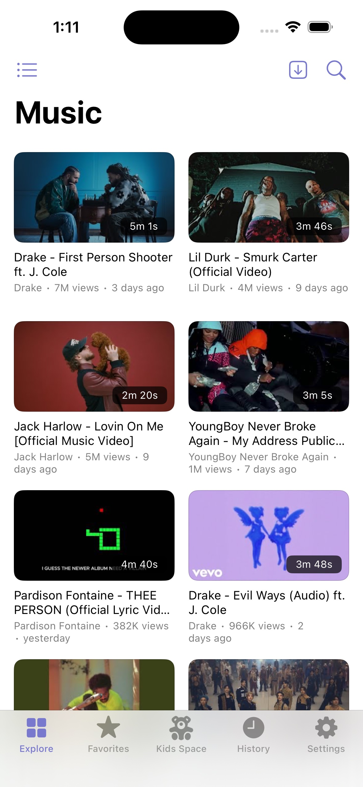
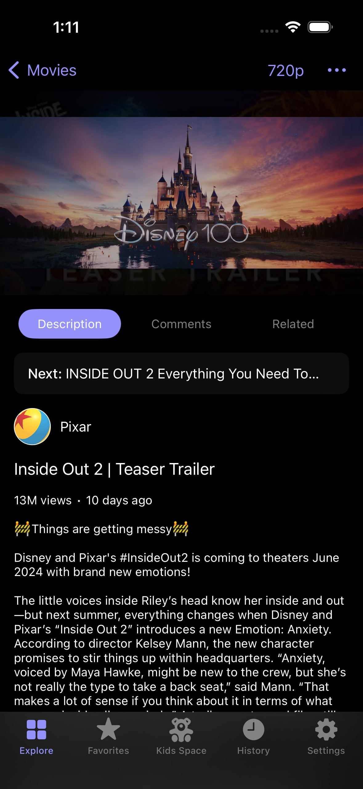
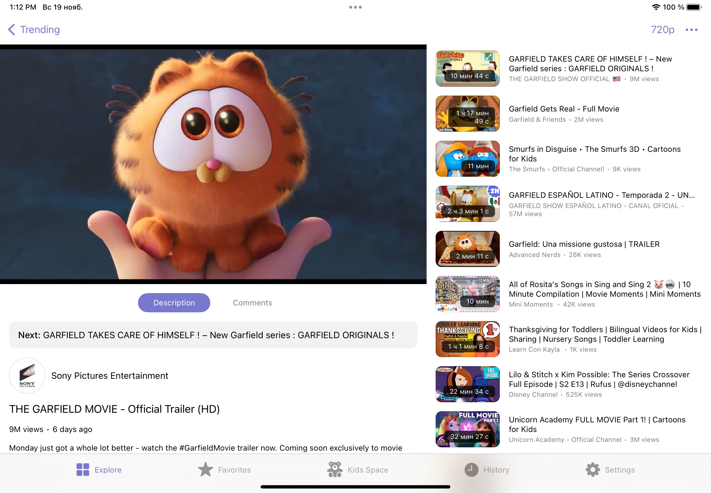
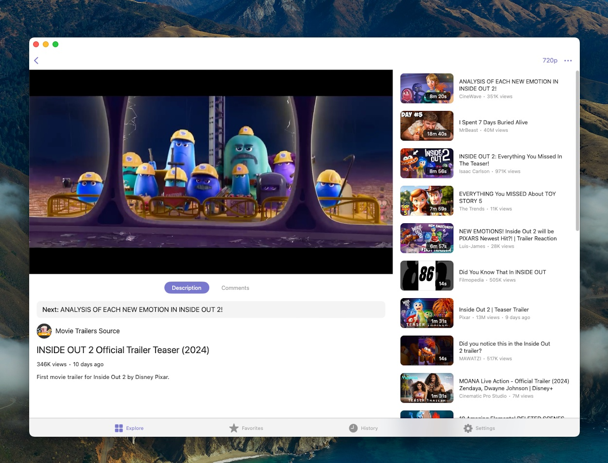

# ivory-ios
iOS/macOS (mac Catalyst) client for [Invidious](https://invidious.io)

• No Ads<br>
• Universal app with split view support<br>
• Background audio playback<br>
• Picture-in-Picture<br>
• Airplay<br>
• Continue playback from the last viewed position in any video<br>
• CloudKit synchronization<br>

Specify URL to Invidious instance in IvoryCore/DIContainer.swift alongside with authKey for accessing to your server.
You can use one of the public instances or host your own.

Also you need to make an iCloud identifier for Cloud Kit container for syncronization of history and favorites between user devices.

```swift
extension String {
    static let baseURL = "https://url.to.your.backend"
    static let authKey: String? = nil // api key for basic authorization
    static let iCloudIdentifier = "icloud.identifier"
}
```

## Screenshots

### iOS
<div>


</div>

### iPadOS


### macOS


## Donation

BTC Bitcoin
```
bc1q2ra5enpyagxnwaad9kvscffzlj6p77vq43gluh
```

BCH Bitcoin Cash (BCH)
```
qr86g6lnlr4nsc9wxa0y0axp90cxk6vkkyc2ju7pa4
```

USDT Tether USD (TRC-20)
```
TWqi1rcX9QwXFXL3PHfCEt8KhABKEXFWP2
```

ETH Ethereum / USDT Tether USD (ERC-20)
```
0x32d67A57F26826DCADE111528A7347aB3bf59C1C
```

## Meta

Ilya Kuznetsov – i.v.kuznecov@gmail.com

Distributed under the Apache 2.0 license. See ``LICENSE`` for more information.

[https://github.com/ivkuznetsov](https://github.com/ivkuznetsov)
